## The 3D Printer Task

```
We have 3D printed a great object, and wanted to show you... unfortunately we only have the video file of the print... and it's corrupted.
But they say when you have 3d printed enough, you don't even hear the sounds. All you hear is blonde, brunette, redhead.
```

The video shows a 3D printer printing some letters (SAF), but than the video freezes, and we can only hear the sounds of the rest of the printing, so our approach was to find out the others letters only by the sound of the printing.

The first thing we had to do was find out which font was used.

.jpg)

.jpg)

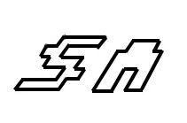

After some(a lot of) research on the internet, we found a similar font, and we assumed the printer was only using the outline of the letters.
https://www.1001fonts.com/freaks-of-nature-font.html

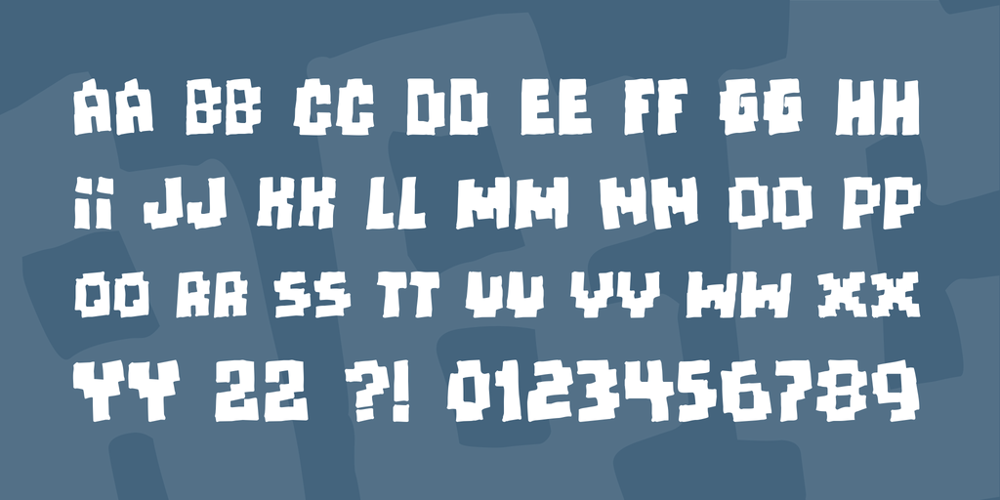

We counted how many traces were needed to draw each letter/number (only the outline), and got the table below.
```
Letter - Number of Traces
I - 4
L - 6
1 - 8
D - 8
T - 8
F - 10
P - 10
Q - 10
0 - 12
A - 12 
B - 12
E - 12
H - 12 
J - 12
O - 12
U - 12
4 - 14
7 - 14
R - 14
5 - 16
6 - 16
9 - 16
K - 16
N - 16
Y - 16
2 - 18
G - 18
3 - 20
C - 20
M - 20
S - 20
V - 20
W - 20
Z - 20
X - 36
```
So we openened the audio on Audacity, and using the spectogram view, we can clearly see the traces.
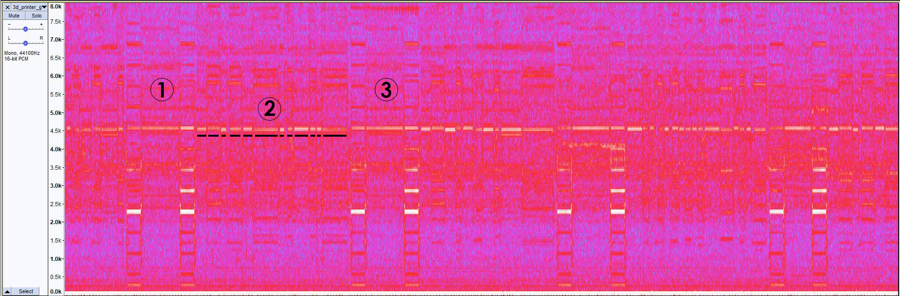

On (1) we have a pattern that repeats a lot in the audio, and when comparing it to the video, we can see that it is the sound of the printer moving to print another letter, so the space between them (2) shows the audio of it printing a letter, and the sound changes a little bit when the machine changes it's direction, so que can count how many traces the letter has (and the size of them). Than on (3) we have the pattern again, so we know it finished printing the letter. 

PS: The printer starts drawing on the bottom left of the letter.

### SAF
On the video we can see that the first three letters are SAF.

S-
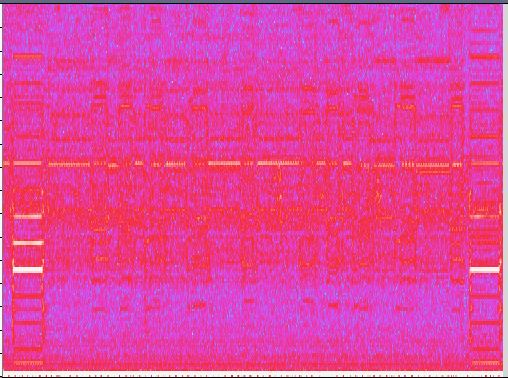

A-
.jpg)

F-
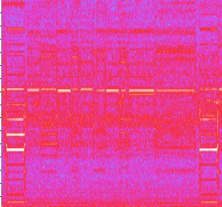

We can use their spectogram to help identifying others letters.

### {
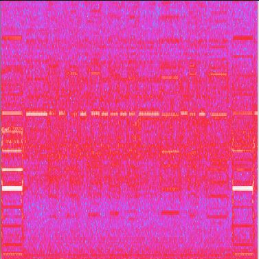

This one has 16 traces, but the size of them don't match any letter from that font, so i assumed it was the '{', because the flag may be in the format SAF{...}

### A
.jpg)

This one has 12 traces, and is very similar to the 'A' we got.

### I
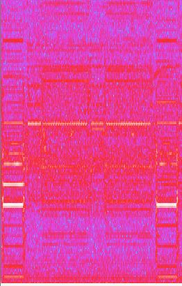

This one has only 4 traces, and by the size of them, its a rectangle, so has to be an 'I'.

### R
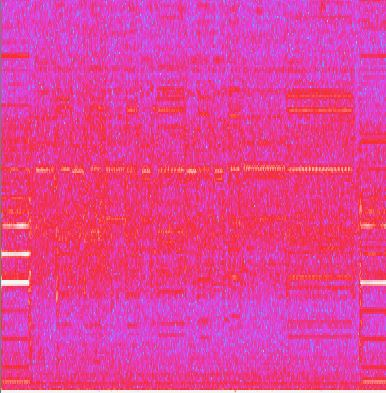

This one has 14 traces, and we can see that the last one is a big one, so it matches the outline of the 'R'.

### G
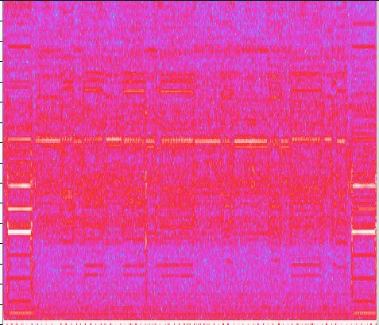

This one has 16 traces, but it didn't fit well in any of the letters with 16 traces of the font, but we thought you may be able to draw a 'G' with 16 traces (intead of 18), and the size of them matches the outline of a 'G'. 

### A
.jpg)

This one has 12 traces and is similar to the others 'A's.

### PP
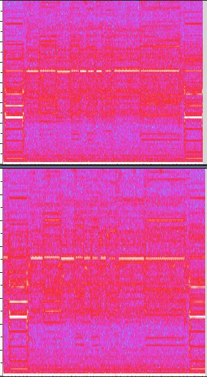

Here we have to letters that are very similar, and have 10 traces, and the size of them matches the 'P'.

### E
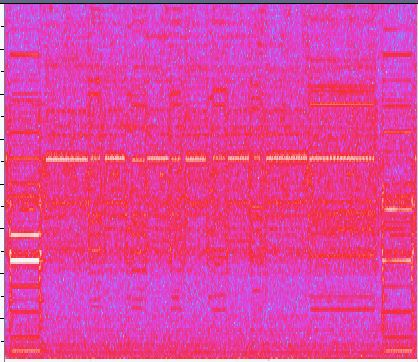

This one has 12 traces, and their sizes matches the outline of the 'E'.

### D
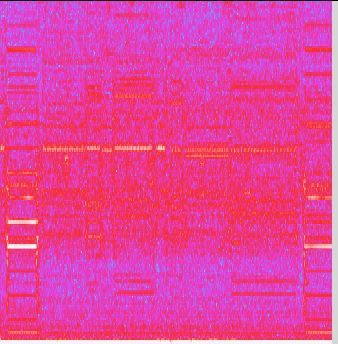

This one has 8 traces, and their sizes mathches the outline of the 'D'.

### 2
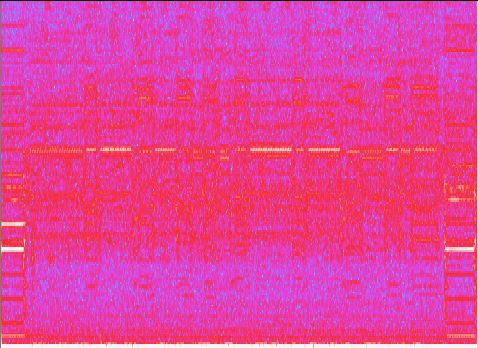

This one has 18 traces, and their sizes did not match any of the letters, so we compared it to the outline of the numbers, and it matches the '2'. 

### }
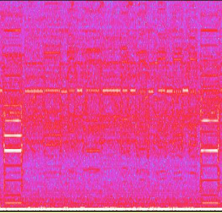

We assumed tha flag had the format SAF{...}, and this one has the same amount of traces than the one we assumed to be an '{'.

```
SAF{AIRGAPPED2}
```
